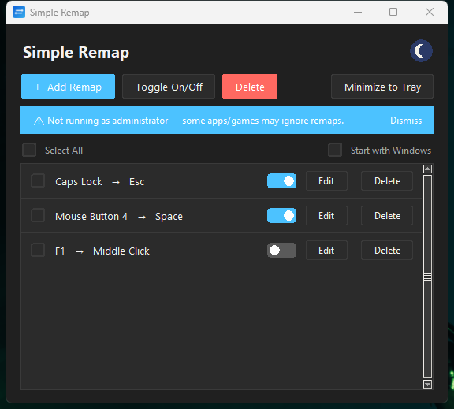

# Simple Remap

A small Windows app for remapping keyboard keys and mouse buttons 1:1 — Caps
Lock to Esc, a side mouse button to Space, that sort of thing. Runs in the
background, lives in the tray, no bloat.



## Features

- Remap any key or mouse button to any other key or mouse button
- Enable/disable individual remaps without deleting them
- Edit an existing remap in place
- Light and dark mode (dark by default)
- Minimize to the system tray (left-click the tray icon to reopen)
- Optional "start with Windows"
- Warns you if you're not running as administrator, since some games/apps
  need that for remaps to take effect
- Remaps persist between runs (`remaps.json`, created next to the app)

Left click can never be used as a remap *source* (it can still be a
destination).

## Download

Grab the latest `SimpleRemap.exe` from the [Releases](/releases) page — no
install needed, just run it. It's unsigned, so Windows SmartScreen will
likely flag it on first run ("Windows protected your PC"); click **More
info -> Run anyway** if you trust the source.

## Running from source

```
pip install -r requirements.txt
python main.py
```

Some apps (games especially) block key/mouse hooks unless you run as
administrator. If a remap doesn't seem to work in a specific app, try
right-click -> Run as administrator on your terminal/IDE.

## Building a standalone .exe

```
build.bat
```

This installs [PyInstaller](https://pyinstaller.org/) and builds
`dist\SimpleRemap.exe` — a single file, no Python install needed to run it.
It still needs administrator rights in the same cases as above.

The built `.exe` isn't tracked in this repo (see `.gitignore`). Pushing a
`v*` tag (e.g. `git tag v1.0.0 && git push origin v1.0.0`) runs
[`.github/workflows/release.yml`](.github/workflows/release.yml), which
builds the exe on a Windows runner and attaches it to a new
[GitHub Release](https://docs.github.com/en/repositories/releasing-projects-on-github)
automatically — no need to build and upload it by hand.

## Running the tests

```
python -m unittest discover -s tests
```

Covers `remap_engine`'s pure logic: loading/saving `remaps.json`, remap
validation, and `apply_remaps` against a mocked `keyboard`/`mouse`/
`mouse_hook` — it never installs a real hook during a test run.

## How it works

- `main.py` — the Tkinter window (add / edit / enable / disable / delete
  remaps, light/dark mode, tray icon).
- `remap_engine.py` — loads/saves `remaps.json`, validates a remap before
  it's added or edited, and turns the remap list into real hooks using the
  [`keyboard`](https://github.com/boppreh/keyboard) and
  [`mouse`](https://github.com/boppreh/mouse) libraries.
- `mouse_hook.py` — a low-level Windows hook (`ctypes`, `WH_MOUSE_LL`) that
  actually blocks a mouse button click so it can be remapped. The `mouse`
  library can detect clicks but can't block them, so this handles that part.
- `winutil.py` — Windows-specific helpers: admin check, DPI awareness, the
  single-instance lock, and the "start with Windows" registry entry.
- `theme.py` / `widgets.py` — the light/dark color palettes and the custom
  canvas-drawn widgets (toggle switches, checkboxes, rounded buttons).
- `tools/generate_icon.py` — regenerates `icon.ico` if the icon design ever
  needs to change.

## License

[MIT](LICENSE)
